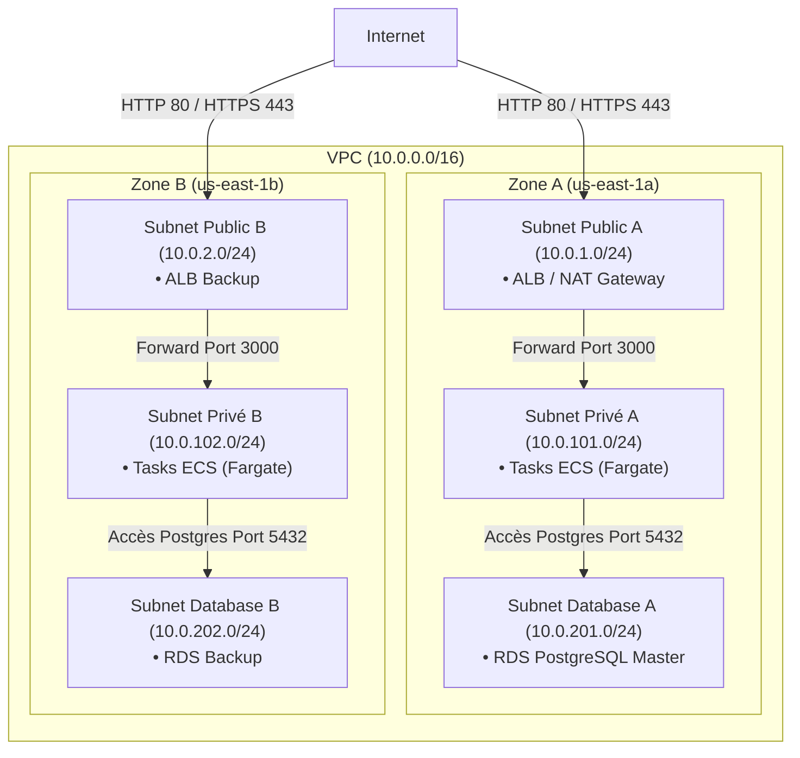
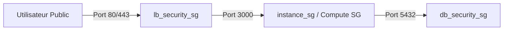

#  Chapitre 1 : Fondations Réseau & Sécurité (VPC)

Ce chapitre détaille la topologie réseau d'AutoPremium. Notre objectif principal est d'isoler l'application et la base de données de l'internet public tout en permettant des communications sortantes contrôlées vers les services tiers.

---

##  Schéma du VPC

Le réseau est hébergé dans un VPC (Virtual Private Cloud) AWS dédié, segmenté en trois niveaux de sous-réseaux (Publics, Privés et Isolés de base de données) répartis sur plusieurs zones de disponibilité (AZ) pour assurer la haute disponibilité.



---

##  Configuration Terraform du VPC

Nous utilisons le module VPC officiel d'AWS pour garantir une configuration propre et modulaire.

```hcl
module "vpc" {
  source  = "terraform-aws-modules/vpc/aws"
  version = "~> 6.6.0"

  name                         = "autopremuim-vpc"
  cidr                         = "10.0.0.0/16"
  azs                          = ["us-east-1a", "us-east-1b"]

  # Découpage des sous-réseaux
  public_subnets               = ["10.0.1.0/24", "10.0.2.0/24"]     # Routage internet direct
  private_subnets              = ["10.0.101.0/24", "10.0.102.0/24"] # Routage via NAT Gateway
  database_subnets             = ["10.0.201.0/24", "10.0.202.0/24"] # Aucun accès internet sortant

  create_database_subnet_group = true
  enable_dns_hostnames         = true
  enable_dns_support           = true
  map_public_ip_on_launch      = true

  # Configuration de la NAT Gateway unique (Optimisation des coûts)
  enable_nat_gateway           = true
  single_nat_gateway          = true
}
```

---

##  Arbitrages Financiers et Routage Sortant

### 1. Pourquoi une NAT Gateway unique ?

Nos conteneurs applicatifs tournent dans les sous-réseaux privés et doivent interagir avec des services tiers comme **Supabase** (Authentification SaaS) situés sur l'internet public.
Pour concilier sécurité et budget, nous avons choisi une topologie à **NAT Gateway unique** (`single_nat_gateway = true`) :

- **Sécurité** : Les tâches ECS n'ont pas d'IP publique, éliminant tout vecteur d'attaque directe depuis internet.
- **Économie** : Une NAT Gateway unique coûte environ **33 \$ / mois** de frais fixes. Cela nous a permis de nous affranchir de 6 points d'accès d'interface VPC (VPC Endpoints ECR, SSM, Logs, Secrets Manager, etc.) qui nous auraient coûté plus de **87 \$ / mois**.

### 2. Le point d'accès S3 Gateway (L'optimisation gratuite)

Toutefois, la NAT Gateway facture **0,045 \$ par Go** de données traitées. Le téléchargement répété de grosses images Docker depuis Amazon ECR (dont les couches physiques d'images sont stockées sur S3) aurait fait exploser cette facture de transfert de données.

Pour contourner cela, nous avons configuré un **VPC Endpoint S3 de type Gateway** (100% gratuit) :

- Le trafic vers S3 est dévié de la NAT Gateway et transite de manière logique et interne dans le réseau AWS.
- Le téléchargement des images Docker par ECS ne génère **aucun frais de traitement réseau**.

```hcl
module "vpc_endpoints" {
  source  = "terraform-aws-modules/vpc/aws//modules/vpc-endpoints"
  version = "~> 6.6.0"
  vpc_id  = module.vpc.vpc_id

  endpoints = {
    s3 = {
      service         = "s3"
      service_type    = "Gateway"
      # Associé uniquement aux tables de routage des tâches applicatives privées
      route_table_ids = module.vpc.private_route_table_ids
    }
  }
}
```

---

##  Isolation par Groupes de Sécurité (Security Groups)

Nous appliquons une politique de pare-feu stricte avec le principe du moindre privilège :



### 1. Sécurité du Load Balancer

L'ALB est public et n'accepte que le trafic public sur les ports **80** (HTTP) et **443** (HTTPS) :

```hcl
resource "aws_security_group" "lb_security" {
  name_prefix = "lb_security_"
  vpc_id      = module.vpc.vpc_id

  egress {
    cidr_blocks = ["0.0.0.0/0"]
    from_port   = 0
    to_port     = 0
    protocol    = "-1"
  }
}
```

### 2. Sécurité de la Couche Applicative (Compute)

Qu'elle s'exécute sur EC2 ou sur ECS Fargate, l'application Next.js utilise le même groupe de sécurité générique. Ce dernier n'autorise de trafic entrant sur le port **3000** que s'il provient du Load Balancer :

```hcl
resource "aws_security_group" "instnace_security" {
  name_prefix = "compute_security_"
  vpc_id      = module.vpc.vpc_id
}

resource "aws_vpc_security_group_ingress_rule" "allow_lb_to_compute" {
  security_group_id            = aws_security_group.instnace_security.id
  ip_protocol                  = "tcp"
  from_port                    = 3000
  to_port                      = 3000
  referenced_security_group_id = aws_security_group.lb_security.id
}
```

### 3. Sécurité de la Base de Données (RDS)

Le groupe de sécurité de la base de données RDS PostgreSQL n'autorise le trafic entrant (port **5432**) que s'il provient de la couche applicative (`compute_security_`) ou de la Lambda de rotation de mot de passe :

```hcl
resource "aws_security_group" "db_security" {
  name_prefix = "db_security_"
  vpc_id      = module.vpc.vpc_id
}

resource "aws_vpc_security_group_ingress_rule" "allow_compute_to_db" {
  description                  = "Allow application containers to query database"
  ip_protocol                  = "tcp"
  security_group_id            = aws_security_group.db_security.id
  from_port                    = 5432
  to_port                      = 5432
  referenced_security_group_id = aws_security_group.instnace_security.id
}
```
