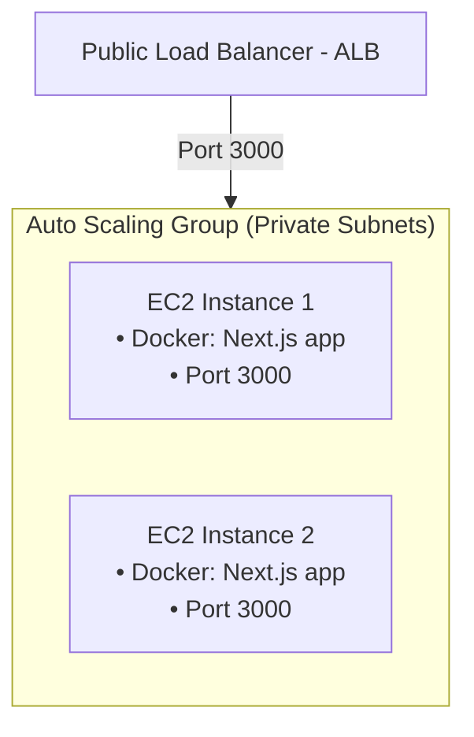

#  Chapitre 2 : Architecture Phase 1 : EC2 AutoScaling

Ce chapitre détaille l'architecture initiale d'AutoPremium reposant sur des serveurs virtuels Amazon EC2 gérés via un groupe d'Auto Scaling. Bien que cette architecture ait permis de valider le fonctionnement initial, elle a mis en évidence des contraintes d'exploitation majeures.

---

##  Structure de l'Architecture EC2

L'infrastructure initiale utilisait un groupe d'Auto Scaling (ASG) configuré pour lancer dynamiquement des instances EC2 dans les sous-réseaux privés en fonction de la charge CPU.



---

##  Configuration Terraform de la stack EC2

Voici comment les ressources d'AutoScaling et le Launch Template étaient configurés :

```hcl
# Launch Template définissant les propriétés des instances EC2
resource "aws_launch_template" "app_template" {
  name_prefix   = "autopremuim-template-"
  image_id      = "ami-0c7217cdde317cfec" # Amazon Linux 2023 AMI
  instance_type = "t3.micro"

  network_interfaces {
    associate_public_ip_address = false
    security_groups             = [module.common_config.instance_sg]
  }

  iam_instance_profile {
    # Rôle IAM local autorisant l'instance à lire les secrets et ECR
    name = aws_iam_instance_profile.ec2_profile.name
  }

  # Script de bootstrapping au démarrage de l'instance
  user_data = filebase64("${path.module}/run-docker.sh")
}

# Groupe d'Auto Scaling pour ajuster le nombre d'instances
resource "aws_autoscaling_group" "app_asg" {
  vpc_zone_identifier = module.common_config.private_subnets
  desired_capacity    = 2
  max_size            = 4
  min_size            = 1

  target_group_arns = [module.common_config.lb_target_group_arn]

  launch_template {
    id      = aws_launch_template.app_template.id
    version = "$Latest"
  }
}
```

---

##  Le Script de Démarrage (`run-docker.sh`)

Chaque instance EC2 exécutait à son démarrage un script Bash pour installer le moteur Docker, s'authentifier sur ECR, récupérer les secrets de base de données en clair via l'AWS CLI, puis lancer le conteneur applicatif :

```bash
#!/bin/bash
# Installation de Docker
dnf update -y
dnf install -y docker
systemctl start docker
systemctl enable docker

# Récupération de l'image depuis Amazon ECR
aws ecr get-login-password --region us-east-1 | docker login --username AWS --password-stdin 108750422878.dkr.ecr.us-east-1.amazonaws.com

# Récupération des secrets applicatifs pour les injecter dans le conteneur
SECRET_VAL=$(aws secretsmanager get-secret-value --secret-id app/database/credentials --query SecretString --output text)
DB_USER=$(echo $SECRET_VAL | jq -r '.username')
DB_PASS=$(echo $SECRET_VAL | jq -r '.password')

# Lancement du conteneur applicatif sur le port 3000
docker run -d --name app \
  -p 3000:3000 \
  -e DB_USER="$DB_USER" \
  -e DB_PASSWORD="$DB_PASS" \
  108750422878.dkr.ecr.us-east-1.amazonaws.com/autopremuim:latest
```

---

##  Limites et Problèmes Rencontrés

Cette première version sur instances EC2 a rapidement montré ses limites opérationnelles et structurelles :

### 1. Lenteur de Provisionnement (Temps de Scalabilité)
Le démarrage d'une nouvelle instance EC2 lors d'un pic de charge prend entre **3 et 5 minutes**. Ce délai comprend :
*   Le démarrage de l'hyperviseur et de l'OS Linux.
*   L'exécution du script `user_data` (téléchargement et installation des paquets système comme `docker` et `jq`).
*   Le pull de l'image Docker depuis ECR.
*   Le démarrage du conteneur.
Pendant cette attente, l'application peut subir des ralentissements majeurs.

### 2. Maintenance et Gestion de l'OS (Surcharge Opérationnelle)
Les instances EC2 sont des serveurs complets. Nous étions responsables du maintien de l'OS :
*   Application régulière des correctifs de sécurité Linux.
*   Surveillance de l'état du daemon Docker sur chaque instance.
*   Gestion de l'espace disque (les anciennes images Docker non nettoyées saturaient rapidement le disque de l'instance).

### 3. Gaspillage des Ressources (Coûts Sous-Optimisés)
Avec des instances de type `t3.micro`, nous payons l'intégralité des ressources de la machine virtuelle. Si notre application Next.js n'utilise que 15% du CPU d'une instance, les 85% restants sont perdus mais facturés. Le découpage en conteneurs sur EC2 manque de flexibilité budgétaire.

### 4. Dépendance aux Scripts de Bootstrap Fragiles
Le script `run-docker.sh` est un point de défaillance critique. Si le gestionnaire de paquets AWS (`dnf`) rencontre un problème réseau ou si une commande `jq` échoue, l'instance démarre mais le conteneur ne se lance pas. L'ALB détecte alors une instance en mauvaise santé (`unhealthy`) et le groupe d'Auto Scaling la détruit pour en créer une nouvelle, créant une boucle infinie de création/destruction d'instances instables.

C'est pour résoudre l'ensemble de ces problématiques que nous avons décidé de migrer vers une architecture moderne de conteneurs serverless : **Amazon ECS Fargate**.
