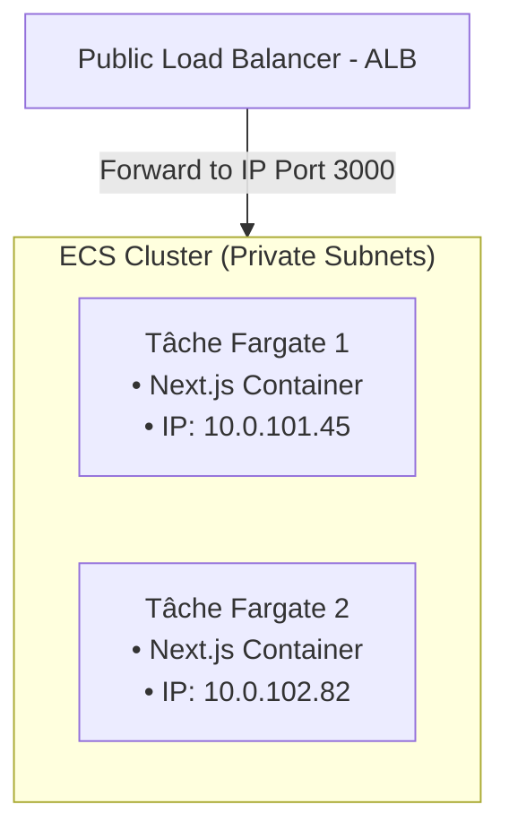

#  Chapitre 3 : Architecture Phase 2 : ECS Fargate Serverless

Ce chapitre présente la conception de notre infrastructure moderne de conteneurs serverless basée sur Amazon ECS (Elastic Container Service) et AWS Fargate. Cette solution élimine la gestion des serveurs, réduit les coûts et automatise la gestion du cycle de vie des conteneurs.

---

##  Structure de l'Architecture ECS Fargate

Sous Fargate, nos conteneurs s'exécutent au sein d'un cluster logique. Le provisionnement et le scaling des machines hôtes sont entièrement délégués à AWS.



---

##  Optimisation Budgétaire : Fargate Spot
Pour réduire les coûts fixes, nous utilisons une stratégie de capacité hybride combinant des conteneurs **Fargate** standards (garantis) et **Fargate Spot** (non garantis mais jusqu'à **70% moins chers**) :
*   **Fargate (Base 1, Poids 20)** : Assure qu'au moins 1 conteneur s'exécute en permanence sur de l'infrastructure garantie.
*   **Fargate Spot (Poids 80)** : Les tâches supplémentaires (pour monter en charge) s'exécutent sur de l'infrastructure Spot très économique.

```hcl
resource "aws_ecs_cluster_capacity_providers" "fargate_provider" {
  cluster_name       = aws_ecs_cluster.autopremuim_cluster.name
  capacity_providers = ["FARGATE", "FARGATE_SPOT"]

  default_capacity_provider_strategy {
    capacity_provider = "FARGATE"
    base              = 1
    weight            = 20
  }

  default_capacity_provider_strategy {
    capacity_provider = "FARGATE_SPOT"
    base              = 0
    weight            = 80
  }
}
```

---

##  Configuration de la Task Definition

La Task Definition est la "fiche de recette" qui définit comment le conteneur Next.js doit s'exécuter.

```hcl
resource "aws_ecs_task_definition" "autopremuim_task" {
  family                   = "autopremuim-ecs-task"
  network_mode             = "awsvpc" # Requis pour Fargate (chaque tâche a sa propre ENI)
  requires_compatibilities = ["FARGATE"]
  cpu                      = "256"    # 0.25 vCPU
  memory                   = "512"    # 512 Mo de RAM
  
  task_role_arn            = aws_iam_role.task_role.arn
  execution_role_arn       = aws_iam_role.execution_role.arn

  container_definitions = jsonencode([{
    name      = "autopremuim"
    image     = "${data.aws_caller_identity.current.id}.dkr.ecr.${data.aws_region.current.region}.amazonaws.com/autopremuim:latest"
    essential = true
    
    portMappings = [{
      containerPort = 3000
      hostPort      = 3000
    }]

    # Variables d'environnement standard
    environment = [
      { name = "AWS_SECRET_ID", value = "${module.common_config.db_secret_id}" },
      { name = "AWS_REGION",    value = "${data.aws_region.current.region}" }
    ]

    # Injection native et sécurisée de secrets depuis SSM Parameter Store
    secrets = [
      {
        name      = "SUPABASE_URL"
        valueFrom = "arn:aws:ssm:${data.aws_region.current.region}:${data.aws_caller_identity.current.id}:parameter/app/supabase/url"
      },
      {
        name      = "SUPABASE_PUBLISHABLE_KEY"
        valueFrom = "arn:aws:ssm:${data.aws_region.current.region}:${data.aws_caller_identity.current.id}:parameter/app/supabase/anon_key"
      }
    ]

    # Redirection automatique de la console vers CloudWatch Logs
    logConfiguration = {
      logDriver = "awslogs"
      options = {
        "awslogs-group"         = aws_cloudwatch_log_group.ecs_logs.name
        "awslogs-region"        = data.aws_region.current.region
        "awslogs-stream-prefix" = "ecs"
      }
    }
  }])
}
```

---

##  Gestion des Rôles IAM (Task vs Execution)

Fargate utilise deux rôles IAM distincts avec des périmètres de sécurité très stricts :

1.  **Task Execution Role (Rôle d'Exécution)** : Utilisé par l'**agent Fargate d'AWS** (en dehors de votre application) au démarrage de la tâche. Ce rôle l'autorise à :
    *   S'authentifier auprès d'Amazon ECR pour puller l'image Docker.
    *   Créer et envoyer les flux de logs vers CloudWatch Logs.
    *   Interroger SSM Parameter Store et Secrets Manager pour récupérer les chaînes de connexion et les injecter dans l'environnement du conteneur avant son démarrage.
2.  **Task Role (Rôle de la Tâche)** : Utilisé par **votre application Next.js** en cours d'exécution. Ce rôle l'autorise à :
    *   Faire des appels à AWS Secrets Manager pour la rotation des mots de passe.
    *   Interagir avec le bucket S3 pour uploader les fichiers (photos de véhicules, etc.).

---

##  Configuration du Service ECS & Protection du Cycle de Vie

Le Service ECS maintient le nombre de tâches désiré et gère les déploiements de code (Rolling Update).

```hcl
resource "aws_ecs_service" "autopremuim_service" {
  name            = "autopremuim-service"
  cluster         = aws_ecs_cluster.autopremuim_cluster.name
  task_definition = aws_ecs_task_definition.autopremuim_task.arn
  desired_count   = 3

  deployment_minimum_healthy_percent = 100 # Garantit qu'au moins 3 tâches tournent pendant un déploiement
  deployment_maximum_percent         = 200 # Autorise jusqu'à 6 tâches temporaires pendant le déploiement

  network_configuration {
    assign_public_ip = false
    subnets          = module.common_config.private_subnets
    security_groups  = [module.common_config.instance_sg] # Utilisation du SG générique
  }

  load_balancer {
    target_group_arn = module.common_config.lb_target_group_arn
    container_name   = "autopremuim"
    container_port   = 3000
  }

  # Protection cruciale contre les dérives (Drift Protection)
  lifecycle {
    ignore_changes = [
      desired_count,              # Évite d'écraser les mises à l'échelle de l'Autoscaling
      task_definition,            # Évite d'annuler les déploiements de code effectués par la CI/CD
      capacity_provider_strategy  # Laisse le service hériter de la stratégie par défaut du cluster
    ]
  }
}
```

---

##  AutoScaling Applicatif (Application AutoScaling)

Au lieu de scaler des instances EC2 complètes, nous scalons directement le nombre de tâches Fargate (les conteneurs) en fonction de l'utilisation réelle du CPU de l'application :

```hcl
# Cible de scaling
resource "aws_appautoscaling_target" "ecs_target" {
  max_capacity       = 5
  min_capacity       = 2
  resource_id        = "service/${aws_ecs_cluster.autopremuim_cluster.name}/${aws_ecs_service.autopremuim_service.name}"
  scalable_dimension = "ecs:service:DesiredCount"
  service_namespace  = "ecs"
}

# Politique de scaling basée sur l'utilisation du CPU
resource "aws_appautoscaling_policy" "ecs_policy_cpu" {
  name               = "target-tracking-cpu"
  policy_type        = "TargetTrackingScaling"
  resource_id        = aws_appautoscaling_target.ecs_target.resource_id
  scalable_dimension = aws_appautoscaling_target.ecs_target.scalable_dimension
  service_namespace  = aws_appautoscaling_target.ecs_target.service_namespace

  target_tracking_scaling_policy_configuration {
    target_value       = 70.0 # Ajuste le nombre de tâches pour stabiliser l'utilisation CPU à 70%
    scale_in_cooldown  = 300
    scale_out_cooldown = 60
    predefined_metric_specification {
      predefined_metric_type = "ECSServiceAverageCPUUtilization"
    }
  }
}
```
