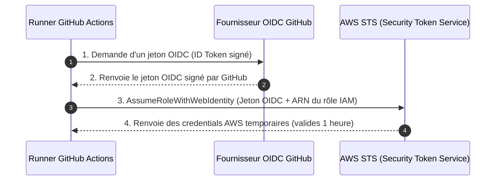

#  Chapitre 4 : Pipeline CI/CD & Automatisation des Déploiements

Ce chapitre détaille le fonctionnement de notre pipeline d'intégration et de déploiement continus (CI/CD) hébergé sur GitHub Actions. Ce pipeline orchestre de manière sécurisée la construction de l'image, l'exécution des migrations de base de données dans le VPC privé et le déploiement sur Amazon ECS.

---

##  Authentification Sans Mot de Passe (OIDC)

Pour éviter de stocker des clés d'accès AWS statiques et à longue durée de vie (`AWS_ACCESS_KEY_ID` / `AWS_SECRET_ACCESS_KEY`) dans les variables secrètes de GitHub, nous utilisons le protocole **OpenID Connect (OIDC)**.



Cette connexion OIDC s'appuie sur le module Terraform partagé pour configurer le rôle IAM de confiance :
```hcl
module "github_actions_role" {
  source      = "terraform-aws-modules/iam/aws//modules/iam-github-oidc-role"
  version     = "~> 5.0"
  name_prefix = "github-actions-role"

  # Restriction stricte au dépôt et à l'organisation GitHub concernés
  subjects = ["repo:org-name/automobile-vitrine:*"]
}
```

---

##  Cache Docker Buildx (9 min ➔ <1 min)

Par défaut, reconstruire l'application Next.js à chaque push nécessite de télécharger à nouveau toutes les dépendances Node.js et de recompiler l'application en repartant de zéro. 

En intégrant **Docker Buildx** et le backend de cache **`type=gha`** (GitHub Actions cache service), les couches Docker inchangées (telles que le dossier `node_modules` et le cache de compilation Next.js) sont réutilisées d'un build à l'autre. Le temps de build de l'image est ainsi divisé par 9.

```yaml
      - name: Set up Docker Buildx
        uses: docker/setup-buildx-action@v3

      - name: Build, Tag et Push de l'image Docker
        uses: docker/build-push-action@v6
        with:
          context: .
          push: true
          tags: |
            ${{ steps.login-ecr.outputs.registry }}/autopremuim:${{ github.sha }}
            ${{ steps.login-ecr.outputs.registry }}/autopremuim:latest
          # Utilisation du cache de GitHub Actions
          cache-from: type=gha
          cache-to: type=gha,mode=max
```

---

##  Le Processus de Migration SQL Sécurisé

Puisque la base de données RDS s'exécute dans des sous-réseaux isolés sans accès internet, le runner de GitHub Actions ne peut pas s'y connecter directement pour exécuter les migrations. 

Nous lançons donc une **tâche Fargate temporaire unique (One-off Task)** s'exécutant au sein des mêmes sous-réseaux privés que notre application, lui permettant de communiquer avec RDS.

### 1. Résolution des Réseaux Dynamique
Le pipeline commence par interroger l'état actif de notre service ECS pour récupérer dynamiquement les identifiants de sous-réseau et de security group utilisés. Cela évite d'avoir à écrire des configurations réseau en dur dans la CI/CD :
```bash
SERVICE_DESC=$(aws ecs describe-services --cluster autopremuim-cluster --services autopremuim-service --region us-east-1)
SUBNETS=$(echo "$SERVICE_DESC" | jq -r '.services[0].networkConfiguration.awsvpcConfiguration.subnets | join(",")')
SECURITY_GROUPS=$(echo "$SERVICE_DESC" | jq -r '.services[0].networkConfiguration.awsvpcConfiguration.securityGroups | join(",")')
```

### 2. Lancement de la Tâche de Migration avec Surcharge
Le runner lance la tâche Fargate en surchargeant la commande par défaut de l'image Docker pour exécuter notre script de migration :
```bash
RUN_TASK_OUT=$(aws ecs run-task \
  --cluster autopremuim-cluster \
  --task-definition autopremuim-ecs-task \
  --launch-type FARGATE \
  --network-configuration "awsvpcConfiguration={subnets=[$SUBNETS],securityGroups=[$SECURITY_GROUPS],assignPublicIp=DISABLED}" \
  --overrides '{"containerOverrides": [{"name": "autopremuim", "command": ["node", "scripts/migrate.js"]}]}' \
  --region us-east-1)
```

---

##  Récupération des Logs depuis CloudWatch en Direct

Le conteneur de migration s'exécute de manière asynchrone sur AWS. Pour donner de la visibilité au développeur dans l'interface de GitHub en cas de bug SQL, le pipeline récupère dynamiquement les logs d'exécution depuis CloudWatch dès l'extinction du conteneur :

```bash
# Extraction de l'ID unique de la tâche
TASK_ARN=$(echo "$RUN_TASK_OUT" | jq -r '.tasks[0].taskArn')
TASK_ID=$(echo "$TASK_ARN" | awk -F '/' '{print $3}')
LOG_STREAM_NAME="ecs/autopremuim/$TASK_ID"

# Attente de l'extinction du conteneur
aws ecs wait tasks-stopped --cluster autopremuim-cluster --tasks "$TASK_ARN" --region us-east-1

# Affichage des logs en direct dans GitHub Actions
echo "=== 📝 MIGRATION CONTAINER LOGS ==="
aws logs get-log-events \
  --log-group-name "/ecs/autopremuim" \
  --log-stream-name "$LOG_STREAM_NAME" \
  --region us-east-1 \
  --query "events[].message" \
  --output text || echo "⚠️ Could not retrieve logs."
echo "==================================="

# Validation du code de retour
EXIT_CODE=$(aws ecs describe-tasks --cluster autopremuim-cluster --tasks "$TASK_ARN" --region us-east-1 | jq -r '.tasks[0].containers[0].exitCode')
if [ "$EXIT_CODE" != "0" ]; then
  echo "❌ DB Migration failed with exit code $EXIT_CODE"
  exit 1
fi
```

---

##  Mise à Jour du Service Applicatif (Rolling Update)

Une fois la migration validée, le pipeline déclenche la mise à jour du service ECS en forçant le téléchargement de la nouvelle image Docker (`--force-new-deployment`). ECS déploie alors les nouveaux conteneurs de façon progressive et attend que le service soit de nouveau stable avant de détruire les anciens conteneurs :

```bash
# Déclenchement de la mise à jour
aws ecs update-service \
  --cluster autopremuim-cluster \
  --service autopremuim-service \
  --force-new-deployment \
  --region us-east-1

# Attente de la stabilisation
aws ecs wait services-stable \
  --cluster autopremuim-cluster \
  --services autopremuim-service \
  --region us-east-1
```
