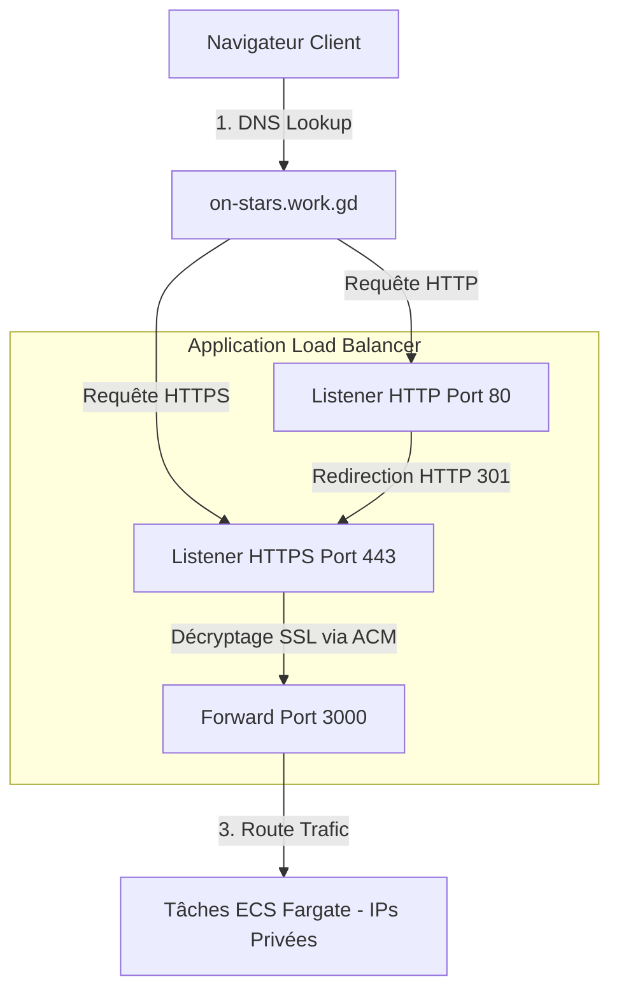

#  Chapitre 5 : Routage Externe, HTTPS & Gestion DNS

Ce chapitre détaille comment le trafic réseau des utilisateurs est acheminé de manière sécurisée depuis l'internet public vers nos conteneurs d'application Next.js via notre nom de domaine, un certificat SSL/TLS et un Application Load Balancer (ALB).

---

##  Schéma du Routage du Trafic Externe

Le flux réseau utilisateur traverse plusieurs étapes de validation et de sécurité avant d'atteindre le conteneur Next.js :



---

##  Certificat SSL/TLS avec AWS ACM

Pour chiffrer tout le trafic de bout en bout et afficher le cadenas de sécurité vert sur le navigateur des utilisateurs, nous utilisons un certificat généré par **AWS Certificate Manager (ACM)** pour le domaine `on-stars.work.gd`.

Dans notre configuration Terraform, nous recherchons dynamiquement ce certificat préexistant sur le compte AWS :
```hcl
data "aws_acm_certificate" "domain_cert" {
  domain      = "on-stars.work.gd"
  statuses    = ["ISSUED"]
  most_recent = true
}
```

---

##  Configuration des Écouteurs de l'ALB

Pour assurer la sécurité et la redirection automatique du trafic non sécurisé, l'ALB gère deux écouteurs (Listeners) :

### 1. Écouteur HTTP (Port 80) : Redirection Automatique 301
Cet écouteur intercepte les requêtes des utilisateurs saisissant l'adresse sans préciser le protocole sécurisé (ex: `http://on-stars.work.gd`) et leur renvoie une redirection permanente (HTTP 301) vers la version sécurisée :

```hcl
resource "aws_lb_listener" "lb_listener" {
  load_balancer_arn = aws_lb.load_balancer.arn
  protocol          = "HTTP"
  port              = 80

  default_action {
    type             = "redirect"
    target_group_arn = null # Requis pour éviter les avertissements d'attributs invalides
    
    redirect {
      port        = "443"
      protocol    = "HTTPS"
      status_code = "HTTP_301"
    }
  }
}
```

### 2. Écouteur HTTPS (Port 443) : Chiffrement SSL de bout en bout
Cet écouteur reçoit le trafic chiffré, valide la clé de chiffrement grâce au certificat ACM récupéré dynamiquement, puis redirige le trafic déchiffré (HTTP simple) vers notre Target Group :

```hcl
resource "aws_lb_listener" "lb_listener_https" {
  load_balancer_arn = aws_lb.load_balancer.arn
  protocol          = "HTTPS"
  port              = 443
  ssl_policy        = "ELBSecurityPolicy-2016-08"
  certificate_arn   = data.aws_acm_certificate.domain_cert.arn

  default_action {
    type             = "forward"
    target_group_arn = aws_lb_target_group.instance_group.arn
  }
}
```

---

##  Target Group : Typage de Cible (`instance` vs `ip`)

Le Target Group est le composant logique de l'ALB chargé de distribuer les requêtes vers les conteneurs en bonne santé. Il existe une différence cruciale dans la configuration du type de cible (`target_type`) selon le déploiement utilisé :

| Propriété | Type `instance` (EC2) | Type `ip` (ECS Fargate) |
| :--- | :--- | :--- |
| **Description** | L'ALB envoie le trafic directement vers l'ID de l'instance EC2. | L'ALB envoie le trafic vers l'adresse IP privée spécifique du conteneur. |
| **Mode Réseau** | Mode Bridge ou Host (partage l'interface réseau de la VM). | Mode `awsvpc` (chaque tâche a sa propre interface réseau ENI). |
| **Flexibilité** | L'ASG enregistre automatiquement les instances créées. | ECS enregistre dynamiquement les IPs des conteneurs Fargate lancés. |

### La Résolution de la Dépendance Cyclique
Pour que notre module partagé `shared_config` reste réutilisable à la fois pour le déploiement EC2 (type `instance`) et le déploiement Fargate (type `ip`), nous avons rendu cet argument dynamique grâce à une variable :

```hcl
# Dans shared_config/main.tf
resource "aws_lb_target_group" "instance_group" {
  port        = var.application_port
  protocol    = "HTTP"
  vpc_id      = module.vpc.vpc_id
  target_type = var.lb_target_type # Dynamique !
  
  health_check {
    path                = "/health"
    interval            = 30
    timeout             = 10
    healthy_threshold   = 3
    unhealthy_threshold = 2
  }
}
```

Lors du déploiement Fargate, la stack passe cette variable à `"ip"` pour éviter que la création du groupe de cibles n'échoue, tout en évitant les conflits de dépendance circulaire dans Terraform.
