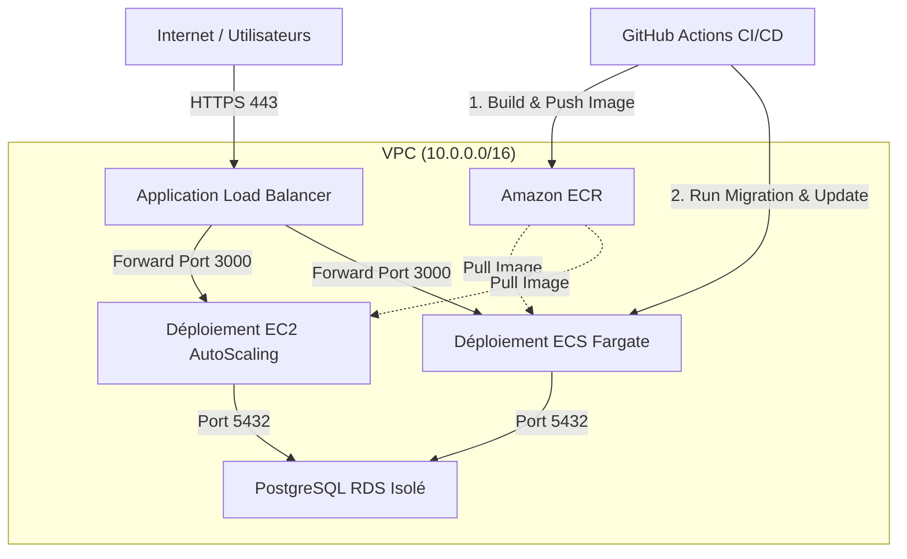

#  Documentation de l'Infrastructure AutoPremium

Bienvenue dans la documentation officielle de l'architecture cloud d'**AutoPremium**, une application web Next.js moderne couplée à une base de données PostgreSQL.

Cette documentation retrace l'évolution technique de notre infrastructure sur AWS (Amazon Web Services), de son déploiement initial sur des serveurs virtuels traditionnels à sa migration vers une architecture de conteneurs serverless hautement sécurisée et optimisée en coûts.

---

##  Structure Globale de l'Infrastructure

L'infrastructure d'AutoPremium est divisée en plusieurs couches réseau et applicatives indépendantes, modélisées intégralement via **Terraform** (Infrastructure as Code).

---

##  Guide de Navigation

Pour comprendre en profondeur les choix d'implémentation et les détails de chaque composant, parcourez les chapitres de la documentation :

### [ 1. Fondations Réseau & Sécurité (VPC)](./01-network-foundation.md)

Découvrez la topologie réseau d'AutoPremium. Ce chapitre détaille le découpage des sous-réseaux (publics, privés et base de données), l'implémentation de la **NAT Gateway** et du **S3 Gateway Endpoint**, ainsi que la politique stricte de filtrage par Security Groups.

### [ 2. Architecture Phase 1 : EC2 AutoScaling](./02-ec2-architecture.md)

Analyse du déploiement initial sur serveurs virtuels. Ce chapitre présente les Launch Templates, les scripts de démarrage (`run-docker.sh`), les règles d'AutoScaling basées sur la charge, et liste les limitations opérationnelles et financières qui ont motivé notre migration.

### [ 3. Architecture Phase 2 : ECS Fargate Serverless](./03-ecs-fargate-architecture.md)

Détails de notre migration vers le serverless de conteneurs. Découvrez la configuration des Task Definitions (Next.js), l'orchestration des services ECS Fargate, la gestion modulaire des rôles IAM (Task vs Execution), et l'injection native des paramètres SSM de manière sécurisée au démarrage du conteneur.

### [ 4. Pipeline CI/CD & Automatisation des Déploiements](./04-cicd-pipeline.md)

Fonctionnement de notre pipeline d'intégration et déploiement continus (GitHub Actions). Ce chapitre explique l'authentification sécurisée par **OIDC (OpenID Connect)**, le cache de build Docker (Buildx), l'exécution de la tâche de migration isolée avant la mise à jour du service, et le streaming dynamique des logs CloudWatch.

### [ 5. Routage Externe, HTTPS & Gestion DNS](./05-dns-ssl-routing.md)

Détails du routage des utilisateurs. Ce chapitre traite de la configuration d'AWS Certificate Manager (ACM) pour le domaine `on-stars.work.gd`, la redirection HTTP (port 80) vers HTTPS (port 443), et la configuration fine du Load Balancer avec les différents types de cibles (`instance` vs `ip`).

---

##  Principes Fondamentaux de Conception

Au cours de la conception de cette infrastructure, trois priorités majeures ont guidé nos arbitrages techniques :

- **Sécurité maximale (Least Privilege)** : Zéro accès public direct vers les serveurs applicatifs ou la base de données. Tous les secrets sont résolus dynamiquement à l'exécution sans mot de passe en clair dans le code ou les pipelines.
- **Optimisation des coûts (Frugalité Cloud)** : Remplacement de 6 Interface VPC Endpoints payants par une NAT Gateway unique, et contournement des frais de transfert de la NAT Gateway via un S3 Gateway gratuit pour les images Docker.
- **Automatisation complète** : 100% de l'infrastructure est codée avec Terraform, et chaque mise à jour de code applicatif déclenche un déploiement sans coupure de service.
